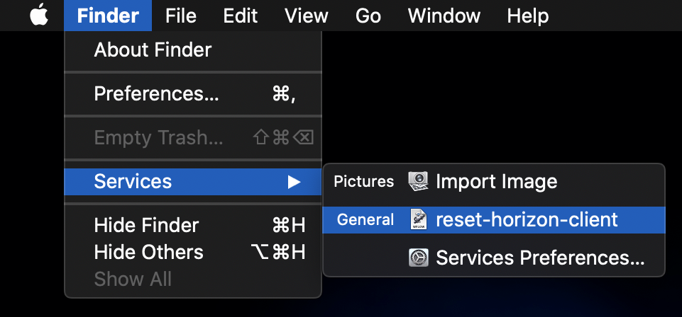

# reset-horizon-client
macOS Automator workflow to reinstall VMware Horizon View client

# Introduction
The experience of using VMware Horizon View on macOS has been fairly disappointing for me - I frequently notice that I encounter "SSL Connection Error" or "Connection timed out" problems in connecting to my desktop, which are only alleviated upon uninstalling and reinstalling the client. I also have noticed that sometimes, a complete reboot of my machine is required in order to get the connection into a workable state.

As I've spent a fair amount of time trying manual workarounds to make this work, I ended up automating the process. This repoi provides a macOS Automator "Quick Actions" workflow (`reset-horizon-client`) that makes it as simple as one click to perform the following steps:
* Quit VMware Horizon Client
* Quit Cisco AnyConnect Client
* Reinstall the Horizon Client (by deleting it from /Applications, then copying it back from the official disk image)
* Reboot

# Prerequisites
* MacOS Catalina (I have not tested on any prior versions)
* VMware Horizon View installer client (`VMware-Horizon-Client-5.4.2-15910566.dmg`) is available on the Desktop

# How to use
> :warning: **This workflow will reboot your computer without further confirmation once it is finished.** Make sure that you have saved all work, and use at your own risk!

1. Clone this repo - `git clone https://github.com/bghinkle/reset-horizon-client.git`
2. Copy the workflow to your local Services folder - `cp -r reset-horizon-client/reset-horizon-client.workflow ~/Library/Services/`
3. Open the Finder - then click on the Finder menu in the menu bar, then Services, then "reset-horizon-client" (example below)
